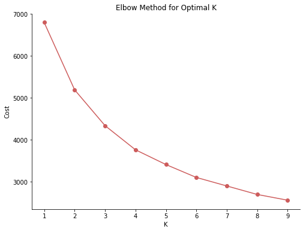
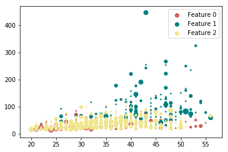
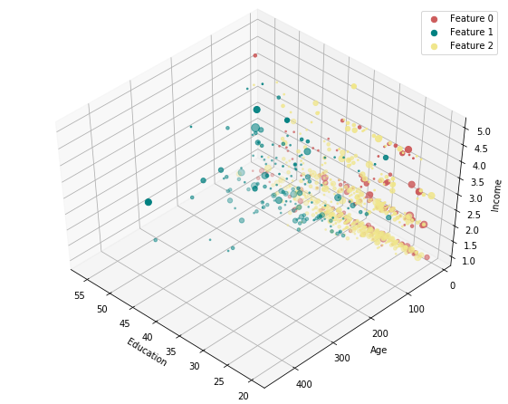

Applying customer segmentation on historical data. We want to partition a customer base into groups of individuals that have similar characteristics, such as age, income and so on.


```python
import random 
import numpy as np 
import pandas as pd
import matplotlib.pyplot as plt 
from sklearn.cluster import KMeans  
%matplotlib inline

```


```python
df=pd.read_csv('https://s3-api.us-geo.objectstorage.softlayer.net/cf-courses-data/CognitiveClass/ML0101ENv3/labs/Cust_Segmentation.csv')
df.head(5)
```


<div>
<style scoped>
    .dataframe tbody tr th:only-of-type {
        vertical-align: middle;
    }

    .dataframe tbody tr th {
        vertical-align: top;
    }

    .dataframe thead th {
        text-align: right;
    }
</style>
<table border="1" class="dataframe">
  <thead>
    <tr style="text-align: right;">
      <th></th>
      <th>Customer Id</th>
      <th>Age</th>
      <th>Edu</th>
      <th>Years Employed</th>
      <th>Income</th>
      <th>Card Debt</th>
      <th>Other Debt</th>
      <th>Defaulted</th>
      <th>Address</th>
      <th>DebtIncomeRatio</th>
    </tr>
  </thead>
  <tbody>
    <tr>
      <th>0</th>
      <td>1</td>
      <td>41</td>
      <td>2</td>
      <td>6</td>
      <td>19</td>
      <td>0.124</td>
      <td>1.073</td>
      <td>0.0</td>
      <td>NBA001</td>
      <td>6.3</td>
    </tr>
    <tr>
      <th>1</th>
      <td>2</td>
      <td>47</td>
      <td>1</td>
      <td>26</td>
      <td>100</td>
      <td>4.582</td>
      <td>8.218</td>
      <td>0.0</td>
      <td>NBA021</td>
      <td>12.8</td>
    </tr>
    <tr>
      <th>2</th>
      <td>3</td>
      <td>33</td>
      <td>2</td>
      <td>10</td>
      <td>57</td>
      <td>6.111</td>
      <td>5.802</td>
      <td>1.0</td>
      <td>NBA013</td>
      <td>20.9</td>
    </tr>
    <tr>
      <th>3</th>
      <td>4</td>
      <td>29</td>
      <td>2</td>
      <td>4</td>
      <td>19</td>
      <td>0.681</td>
      <td>0.516</td>
      <td>0.0</td>
      <td>NBA009</td>
      <td>6.3</td>
    </tr>
    <tr>
      <th>4</th>
      <td>5</td>
      <td>47</td>
      <td>1</td>
      <td>31</td>
      <td>253</td>
      <td>9.308</td>
      <td>8.908</td>
      <td>0.0</td>
      <td>NBA008</td>
      <td>7.2</td>
    </tr>
  </tbody>
</table>
</div>


```python
## drop address, because kmeans isnt applicable with catagorical variables
df1=df.drop('Address',axis=1)
print(df1.head(5))
##check if there's any missing value
print(df.isna().sum())
print(df.count())
```

       Customer Id  Age  Edu  Years Employed  Income  Card Debt  Other Debt  \
    0            1   41    2               6      19      0.124       1.073   
    1            2   47    1              26     100      4.582       8.218   
    2            3   33    2              10      57      6.111       5.802   
    3            4   29    2               4      19      0.681       0.516   
    4            5   47    1              31     253      9.308       8.908   
    
       Defaulted  DebtIncomeRatio  
    0        0.0              6.3  
    1        0.0             12.8  
    2        1.0             20.9  
    3        0.0              6.3  
    4        0.0              7.2  
    Customer Id          0
    Age                  0
    Edu                  0
    Years Employed       0
    Income               0
    Card Debt            0
    Other Debt           0
    Defaulted          150
    Address              0
    DebtIncomeRatio      0
    dtype: int64
    Customer Id        850
    Age                850
    Edu                850
    Years Employed     850
    Income             850
    Card Debt          850
    Other Debt         850
    Defaulted          700
    Address            850
    DebtIncomeRatio    850
    dtype: int64


```python
from sklearn.preprocessing import StandardScaler
# X = df1.values[:,1:]
# X = np.nan_to_num(X)##replace nan with 0 and inf with large finite numbers
X=df1.iloc[:,1:].fillna(0)
# print(X['Defaulted'].tolist())
Clus_dataSet = StandardScaler().fit_transform(X.values)
clus_dataSet=pd.DataFrame(Clus_dataSet,columns=['Age','Edu','Years Employed','Income','Card Debt','Other Debt','Defaulted','DebtIncomeRatio'])
clus_dataSet.head(5)
```


<div>
<style scoped>
    .dataframe tbody tr th:only-of-type {
        vertical-align: middle;
    }

    .dataframe tbody tr th {
        vertical-align: top;
    }

    .dataframe thead th {
        text-align: right;
    }
</style>
<table border="1" class="dataframe">
  <thead>
    <tr style="text-align: right;">
      <th></th>
      <th>Age</th>
      <th>Edu</th>
      <th>Years Employed</th>
      <th>Income</th>
      <th>Card Debt</th>
      <th>Other Debt</th>
      <th>Defaulted</th>
      <th>DebtIncomeRatio</th>
    </tr>
  </thead>
  <tbody>
    <tr>
      <th>0</th>
      <td>0.742915</td>
      <td>0.312122</td>
      <td>-0.378790</td>
      <td>-0.718459</td>
      <td>-0.683811</td>
      <td>-0.590489</td>
      <td>-0.523797</td>
      <td>-0.576525</td>
    </tr>
    <tr>
      <th>1</th>
      <td>1.489490</td>
      <td>-0.766349</td>
      <td>2.573721</td>
      <td>1.384325</td>
      <td>1.414474</td>
      <td>1.512962</td>
      <td>-0.523797</td>
      <td>0.391387</td>
    </tr>
    <tr>
      <th>2</th>
      <td>-0.252518</td>
      <td>0.312122</td>
      <td>0.211712</td>
      <td>0.268032</td>
      <td>2.134141</td>
      <td>0.801704</td>
      <td>1.909138</td>
      <td>1.597554</td>
    </tr>
    <tr>
      <th>3</th>
      <td>-0.750235</td>
      <td>0.312122</td>
      <td>-0.674041</td>
      <td>-0.718459</td>
      <td>-0.421643</td>
      <td>-0.754467</td>
      <td>-0.523797</td>
      <td>-0.576525</td>
    </tr>
    <tr>
      <th>4</th>
      <td>1.489490</td>
      <td>-0.766349</td>
      <td>3.311849</td>
      <td>5.356249</td>
      <td>3.638900</td>
      <td>1.716094</td>
      <td>-0.523797</td>
      <td>-0.442507</td>
    </tr>
  </tbody>
</table>
</div>


```python
##modeling
clusterNum = 3
k_means = KMeans(init = "k-means++", n_clusters = clusterNum, random_state=1,n_init = 12)
k_means.fit(clus_dataSet)
# labels = k_means.labels_
# print(labels)
pre=k_means.predict(clus_dataSet)
print(pre)
```

    [2 1 0 2 1 1 2 2 2 1 0 2 2 2 0 2 2 2 1 2 2 2 0 1 1 2 2 2 2 2 2 1 0 2 2 2 0
     0 2 1 0 1 2 1 2 1 2 2 2 2 1 1 0 2 0 0 0 2 2 2 1 2 1 1 2 2 2 0 2 0 2 2 2 2
     2 2 2 2 1 2 2 0 1 2 1 2 2 2 0 0 2 2 0 0 2 2 2 2 0 2 0 1 2 0 0 1 2 2 2 2 2
     2 2 0 2 2 2 2 1 2 2 2 2 2 2 2 2 2 2 2 2 2 2 2 2 2 2 2 2 0 0 2 2 2 1 2 2 0
     2 2 2 1 0 2 2 2 2 1 0 0 2 1 2 2 2 2 2 2 2 2 1 2 2 0 2 0 2 2 0 1 0 2 2 1 0
     1 2 2 2 2 2 1 2 0 2 2 2 1 1 2 1 2 0 2 2 0 2 1 2 0 2 2 2 2 2 0 0 1 2 2 0 1
     2 2 2 2 1 2 2 0 2 2 2 2 1 2 2 0 1 2 2 2 2 2 2 1 2 1 2 2 2 2 2 2 1 0 2 0 2
     2 2 1 2 0 1 0 2 1 2 2 0 2 2 2 2 0 0 0 2 2 2 1 2 2 1 2 1 2 2 1 2 2 2 0 2 2
     0 2 0 1 2 2 2 2 0 2 2 0 0 2 2 2 2 2 2 2 2 0 2 0 1 2 0 2 2 2 0 0 2 2 2 1 0
     2 2 0 2 1 2 2 2 2 2 0 1 2 2 2 2 2 1 2 2 2 2 2 1 2 2 2 1 0 2 0 2 2 2 1 1 2
     0 2 1 0 0 2 2 2 0 2 2 2 2 2 1 2 1 2 2 2 2 0 2 0 2 2 2 1 2 2 2 2 0 2 2 0 0
     1 2 2 2 2 2 0 0 2 1 0 1 2 2 0 2 2 1 1 2 0 2 2 1 2 0 2 1 2 2 2 1 2 2 2 2 1
     2 0 2 2 2 2 1 0 2 2 1 2 0 2 2 1 2 1 2 2 2 2 2 2 2 1 1 2 2 1 2 0 2 2 2 0 2
     0 2 2 2 2 2 1 0 0 2 1 2 1 2 2 0 1 2 0 0 0 1 1 0 2 2 0 2 0 0 2 0 1 2 2 0 2
     0 1 0 2 2 0 2 2 0 0 0 2 2 2 1 1 2 2 0 2 2 0 1 2 0 2 2 2 0 2 1 2 1 1 2 1 2
     2 1 2 0 2 2 2 2 0 0 2 1 2 1 2 2 1 2 0 2 0 2 0 0 0 1 0 2 2 2 0 2 2 2 1 2 1
     2 0 0 2 2 2 2 2 2 2 0 1 2 1 2 2 0 2 2 2 0 2 2 0 0 0 0 2 1 2 0 0 2 2 2 2 1
     1 2 0 2 2 1 2 2 1 2 1 2 2 1 0 1 1 1 0 2 2 0 2 1 1 2 2 2 1 0 2 2 2 2 1 2 2
     2 2 2 0 2 2 1 2 2 1 2 2 2 2 2 2 0 1 2 2 0 2 2 2 2 0 2 1 2 2 1 2 2 0 2 0 2
     0 0 2 2 2 1 0 1 2 1 1 2 0 2 1 2 1 2 2 2 2 2 1 2 0 2 2 1 1 2 2 1 2 2 2 2 2
     2 2 2 0 2 2 1 2 2 2 2 2 2 2 0 2 2 2 1 0 1 1 2 2 2 0 2 2 2 0 0 2 0 2 2 2 1
     2 2 2 2 2 2 2 1 2 2 2 2 2 2 1 1 0 0 2 0 2 2 2 2 1 0 2 2 2 2 2 1 0 2 2 2 0
     2 2 0 2 2 2 2 2 2 0 0 1 1 2 2 2 0 2 2 2 2 2 2 2 2 2 2 2 2 2 2 2 2 0 2 1]


```python
###ML
## find optimal parameter
from sklearn.metrics import silhouette_score
inertia=[]
k_=np.arange(1,10)
score=[]
for k in k_:
    kmeans = KMeans(init = "k-means++", n_clusters = k, random_state=1,n_init = 12)
    model = kmeans.fit(clus_dataSet)
    inertia.append(model.inertia_)
    if k>2: #as shown in figure, the elbow points probably is at 3
        preds=model.predict(clus_dataSet)
        score.append(silhouette_score(clus_dataSet, preds, metric='euclidean',random_state=1))
    
## plot elbow
fig, ax = plt.subplots(1,1, figsize =(8,6))
ax.plot(range(1,10),inertia, marker = "o",color='indianred')
plt.title('Elbow Method for Optimal K')
ax.spines['right'].set_visible(False)
ax.spines['top'].set_visible(False)
ax.set_xlabel('K')
ax.set_ylabel('Cost')
plt.show()

##Silhouette
sil=pd.DataFrame(list(zip(k_[2:],score)), columns = ['k','silhouette'])
print(sil)
```





       k  silhouette
    0  3    0.287387
    1  4    0.254121
    2  5    0.249648
    3  6    0.244022
    4  7    0.223430
    5  8    0.212733
    6  9    0.207427


```python
df1["Clus_km"] = pre #k=3
df1.head(5)
df1.groupby('Clus_km').mean()
# print(df1['Defaulted'].tolist())
df1=df1.fillna(0)
# print(df1['Defaulted'].tolist())
```


```python
area = np.pi * ( X.iloc[:, 1])**2
co={0:'indianred',1:'teal',2:'khaki'}
for i in range(3):
    plt.scatter(df1['Age'][df1['Clus_km']==i], df1['Income'][df1['Clus_km']==i], s=area, c=co[i] , label="Feature {:g}".format(i))
plt.legend()
plt.show()


```





```python
from mpl_toolkits.mplot3d import Axes3D 
fig = plt.figure(1, figsize=(8, 6))
# plt.clf()
ax = Axes3D(fig, rect=[0, 0, .95, 1], elev=48, azim=134)
# plt.cla()
ax.set_xlabel('Education')
ax.set_ylabel('Age')
ax.set_zlabel('Income')
for i in range(3):
    ax.scatter(df1['Age'][df1['Clus_km']==i], df1['Income'][df1['Clus_km']==i], df1['Edu'][df1['Clus_km']==i],s=area, c=co[i] , label="Feature {:g}".format(i))
plt.legend()
plt.show()


```




